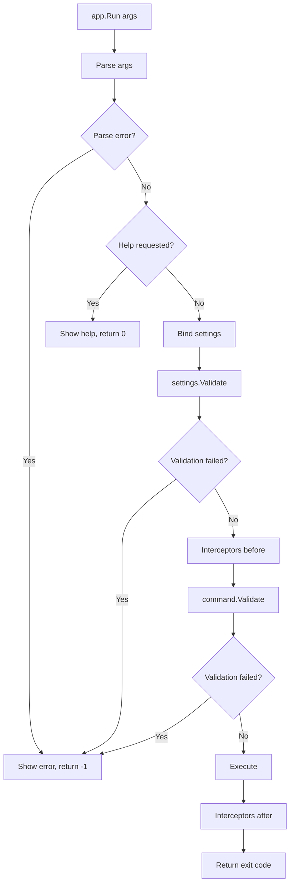

When you call `app.Run(args)`, Spectre.Console.Cli orchestrates a multi-phase pipeline that parses your command line,
validates input, and executes your command. Understanding this flow helps you reason about when your code runs, why
certain errors appear, and how to debug unexpected behavior.

The library processes commands through distinct phases: parsing, help detection, settings binding, validation,
interception, execution, and error handling. Each phase has specific responsibilities and can short-circuit the
pipeline early if something goes wrong or if help is requested.

Execution Flow Overview
-----------------------

The following diagram shows the high-level flow from input to exit code:

Parsing and Command Resolution
------------------------------

The parser tokenizes the argument array and matches tokens against your configured command tree. For nested commands
like `myapp add package Newtonsoft.Json`, the parser walks through each level: first matching `add`, then `package`,
then capturing `Newtonsoft.Json` as an argument.

During parsing, the library builds a `CommandTree` representing the matched command hierarchy. Arguments that don't
match any defined parameter are collected as remaining arguments, accessible via `IRemainingArguments` in your command.

Help detection happens during parsing, not after. When the parser encounters `-h`, `-?`, or `--help`, it sets a flag
on the command node and stops processing further arguments. This means help short-circuits the entire pipeline before
any binding or validation occurs. Branch commands (those with subcommands but no direct execution logic) automatically
show help and return exit code 1.

Settings Binding and Validation
-------------------------------

After parsing, the library creates an instance of your `CommandSettings` class and populates it with parsed values.
If you have a dependency injection container configured, settings can be resolved through constructor injection.
Otherwise, the library creates the instance directly and sets properties via reflection.

Type conversion happens automatically. If an option is declared as `int` and the user provides a string, the library
converts it. Invalid conversions produce clear error messages before your code runs.

Immediately after binding, the library calls `settings.Validate()`. This is your first opportunity to check that the
combination of values makes sense. The `Validate()` method on `CommandSettings` is virtual, returning
`ValidationResult.Success()` by default. Override it to add custom validation logic that runs before command execution.

Command Validation and Execution
--------------------------------

Once settings are validated, the library resolves your command class. If you have dependency injection configured,
the command is resolved from the container, allowing constructor injection of services. Otherwise, it is instantiated
directly.

Before calling `Execute`, the library invokes `command.Validate(context, settings)`. This is a separate validation
point from settings validation. Use it when validation requires the full `CommandContext` or when you need to validate
relationships between settings and external state.

The library then calls `Execute` (or `ExecuteAsync` for async commands). Your command returns an integer exit code.
By convention, 0 indicates success and non-zero values indicate various error conditions.

Interceptors
------------

Interceptors provide hooks before and after command execution. Any class implementing `ICommandInterceptor` registered
in your DI container is automatically resolved and invoked.

The `Intercept` method runs after settings binding but before execution. Use it for cross-cutting concerns like
logging, timing, or modifying settings. The `InterceptResult` method runs after execution and receives the exit code
by reference, allowing you to modify it before it is returned to the caller.

Exit Codes and Error Handling
-----------------------------

Spectre.Console.Cli uses standard exit code conventions: 0 for success, non-zero for errors. The library returns -1
for unhandled exceptions by default.

Exception handling occurs at two levels. The `CommandExecutor` catches exceptions during execution and can invoke a
custom `ExceptionHandler` if configured. If the exception propagates, `CommandApp` catches it and either re-throws
(if `PropagateExceptions` is true) or renders the error and returns -1.

For cancellation scenarios, the library catches `OperationCanceledException` and returns a configurable cancellation
exit code.

Understanding this lifecycle helps diagnose issues: if your `Execute` method never runs, the problem likely occurred
during parsing, binding, or validation. If interceptors don't fire, check that they are registered in your DI
container. The structured pipeline ensures errors are caught early and reported clearly.
